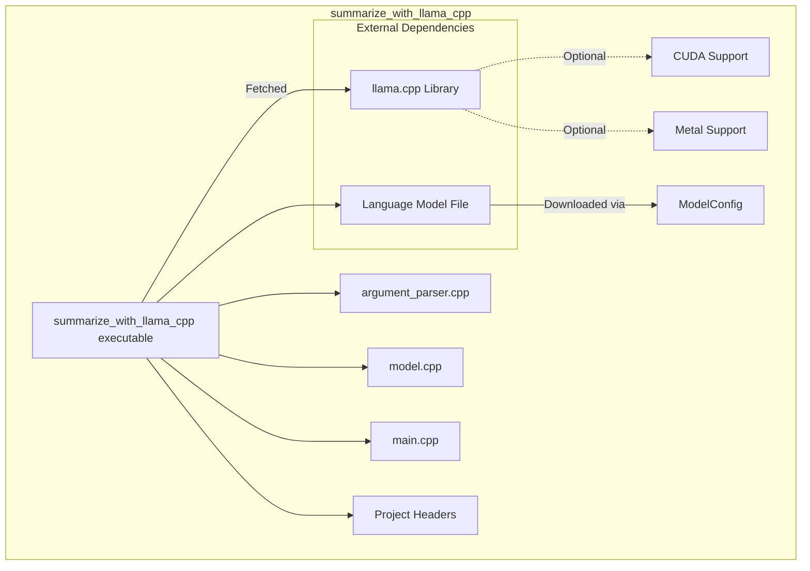
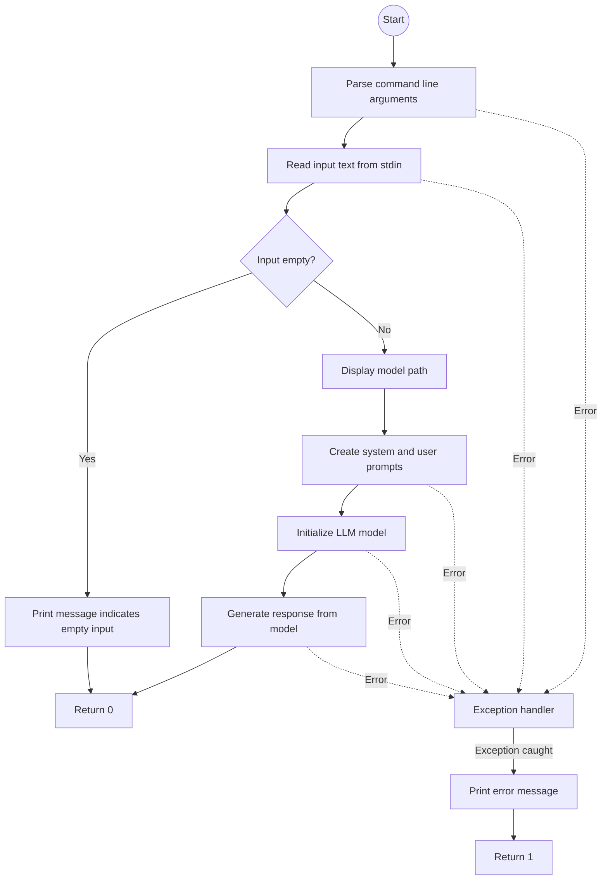
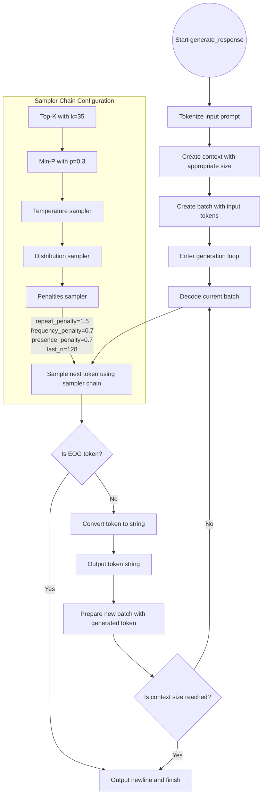

# summarize_with_llama_cpp

This project demonstrates how to use the [`llama.cpp`](https://github.com/ggml-org/llama.cpp) as a static library and use API in C++20.
I took text summarization as an example to demonstrate the usage of the library with tiny models.

It is a simple command-line tool that reads text from stdin and summarizes it using a LLM.
For testing purposes, it downloads a tiny model [SmolLM2-1.7B](https://huggingface.co/HuggingFaceTB/SmolLM2-1.7B) if no `MODEL_URL` is provided to CMake.

## Demo

Running with GPU and SmolLM2-1.7B
---


Running with CPU by providing SmolLM2 135M version, low performance with less accuracy:
---


Building:
---


## Dependencies

It fetches the `llama.cpp` and uses it as a static library.
It also uses the `ModelConfig` module to download the model file if it doesn't exist.

Below is the dependency graph of the project:



## How it works

It reads text from stdin and summarizes it using the LLM model.
First, it parses the command-line arguments and reads the input text.
Then, it initializes the model and generates a response using the model.

I wanted to separate the argument parsing and model generation logic.
So I created a separate [*Argument Parser*](include/argument_parser.h) and a thin [*Model Wrapper*](include/model.h).
Both can be used in other projects, hopefully, portable enough.

### Documentation

More details about those classes can be found in documentation:
* [PDF](doc/latex/refman.pdf) (Readable in GitHub)
* [HTML](doc/html/index.html)

### Main Logic

Below diagram shows the general logic of the `main.cpp`:



### Model Generation Loop

Below diagram shows the logic of the model generation loop and the sampler chain:



Since the model is tiny I added penalties to the sampler chain to make the output more coherent.
Also, I tried to be direct and simple in the system prompt.

## Project structure

```
./
├── build.sh*
├── cmake/
│  ├── LlamaCppSetup.cmake
│  ├── ModelConfig.cmake
│  └── StatusMessage.cmake
├── CMakeLists.txt
├── doc/
├── Doxyfile
├── include/
│  ├── argument_parser.h
│  └── model.h
├── LICENSE
├── README.md
└── src/
   ├── argument_parser.cpp
   ├── main.cpp
   └── model.cpp
```

## How to build

### Quick build with script

You can use the `build.sh` script to build the project.
It will create a `build` directory and build the project with `ninja`.

```bash
./build.sh
```

Below are the options you can use with the script:

```bash
./build.sh --help

Usage: ./build.sh [OPTIONS]
Options:
  --auto-detect       Enable auto detection
  --model-url=URL     Set model URL
  --model-path=PATH   Set model path
  -j, --jobs NUMBER   Number of parallel jobs (default: 8)
  --docs              Generate documentation
  -h, --help          Show this help message
```

### Manual build with CMake

I made it so that that CMake will fetch the `llama.cpp` library and configure it by redirecting its flags.
It adds an additional flag `AUTO_DETECT` to automatically detect CUDA and Metal support (OFF by default).
If you want to enable CUDA or Metal support, you can set `AUTO_DETECT` to ON or set `USE_CUDA` or `USE_METAL` to ON.
By default, it will build the project without GPU support.
It requires [CUDA Toolkit](https://developer.nvidia.com/cuda-downloads) for NVIDIA GPU acceleration and [Metal](https://developer.apple.com/metal/) for Apple GPU acceleration.

It also fetches the model file if it doesn't exist in the specified directory.
The file format is `.gguf` which is a custom format for the `llama.cpp` library.
You can provide the `MODEL_URL` to download the model file (set to `smollm2` by default).

To build the project with `ninja`, you can follow the steps below:

```bash
cmake -G Ninja -DAUTO_DETECT=ON -S . -B build
cmake --build build/ -j 8
```

Artifacts will be placed in the `build/bin` directory.
And by default, the model file will be placed in the `build/models` directory.

### Generate documentation

You can generate the documentation using Doxygen.
It will create a `docs` directory with the HTML documentation and Latex files that can be used for generating PDF file.

```bash
# Build and generate documentation
./build.sh --docs
```

```bash
# Generate documentation only
doxygen Doxyfile
```

## How to run

You can run the executable by providing the input text from stdin.
It will summarize the input text using the LLM model.
It uses the predefined path to the model file if a custom path is not provided.

Below are the options you can use with the executable:

```bash
Usage: ./build/bin/example_llama_app [OPTIONS]

Document Summarizer

Options:
  -m, --model            The path to the model file
  -t, --temperature      The temperature
  -h, --help             Show this help message
```

Example usage:

```bash
man poll | ./build/bin/example_llama_app
```

## Credits

* [ggml-org/llama.cpp](https://github.com/ggml-org/llama.cpp): Used as main library dependency to deal with LLMs.
* [HuggingFace SmolLM2](https://huggingface.co/HuggingFaceTB/SmolLM2-1.7B) and [SmolLM2 Paper](https://arxiv.org/abs/2502.02737): Used as a base testing model.
